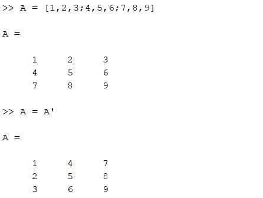
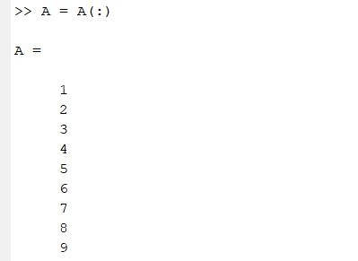
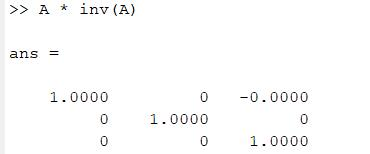
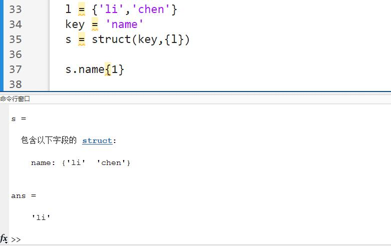
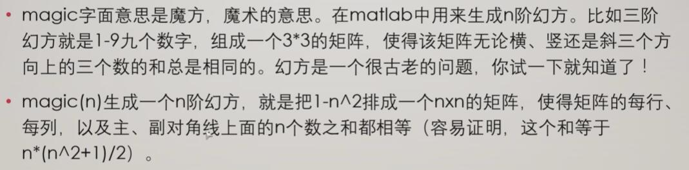
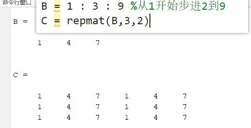
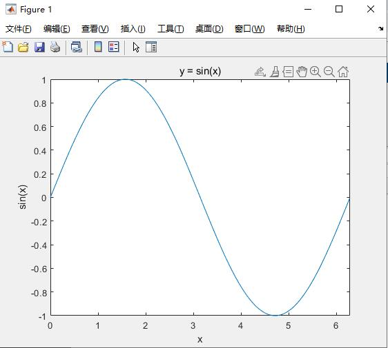

<!--
 * @Description: 
 * @Version: 2.0
 * @Autor: ChenYuxiang
 * @Date: 2023-06-14 22:35:28
 * @LastEditors: ChenYuxiang
 * @LastEditTime: 2023-06-15 02:01:44
-->
# MATLB 学习笔记


---

## 开始  

- ### 进入编辑器

    输入 `edit` 进入编辑器

- ### 清空输入输出  

    `clc`

- ### 注释  

    % 与 %% 
    其中 %% 有个横线

- ### 其他

    - MATLAB从1开始 不是C那种下标从0开始

        ```m
            clear all % 清除ws所有变量
            clc % 清除cmd所有命令
        ```

## 命名规则

- ### 区分大小写

- ### 长度有限制

- ### 字母开头 字母数字下划线组成


## 数据类型

- ### 数字  

- ### 字符字符串  

- ### 矩阵  

    - 定义 
    
        `A = [1,2,3;4,5,6;7,8,9]`  

    - 转置 
    
        `A = A'` 加单引号  

    >   

    - 按列输出 
    
        `A = A(:)`  

    > 

    - 求逆 
        
        `A = inv(A) ` A要可逆

    > 
    

- ### 元胞数组  

    - 定义

        `c = cell(1,6)`生成1行6列的列表类似python
        中的列表没有类型要求  
        
        `c = {'A','B'}`直接定义一个1*2数组元素并赋值

    - 访问使用`cellame`{`index`}来赋值访问

        ```m
            c = cell(1,6)
            c{1} = eye(3) % 赋值
        ``` 


- ### 结构体  

    类似python中的字典

    - 关键字 `struct`
    
    - 定义

        `s = struct('name',{{'Li','Chen'}})`
        
        因为需要 key - value 用一个大括号包括`{'Li','Chen'}`这个列表 value需要是`{value}`
    
    - 使用细节

        


## 函数 

函数名|例子|解释  
---|---|---  
`zeros(a,b,c)`|`E=zeros(10,5,3)`|10行5列3维的0矩阵类似c中`E[3][5][10]`
`rand(a,b)`|`rand(2,3)`|生成2行3列的伪随机数0-1之间
`randn(a,b)`|`randn(2,3)`|生成2行3列的伪随机数不过是**正态分布**均值0方差1
`randi(a,b)`|`randi(2,3)`|生成2行3列的伪随机**整数**i是int  
`eye(a)`|`eye(3)`|生成3*3的[对角单位矩阵](./img/eye.jpg)
`magic(n)`|`magic(3)`|   
`repmat(A,b,c)`|`repmat(A,3,2)`|把A矩阵复制行3次 列2次
`one(a,b)`|`one(2,4)`|生成一个两行四列的全为1的矩阵
`find(X)`|`find(X)`|X 为向量就返回方向与 X 相同的向量 X为多维数组返回由结果的线性索引组成的列向量
---
  
- [rand系列](./img/5.jpg) 

- [zeros(5,5,3)](./img/6.jpg) 5行5列3维的0矩阵 查看第一维

## 矩阵操作

方式|格式|含义
---|---|---
`A = [1,2,3,4,5,6]`|`A = [a,b,c]`|1*6矩阵
`B = 1 : 3 : 9`| `B = start:step:stop`|从1开始步进3到9也就是`B = 1 4 7`并其步进不能省略
矩阵相乘|`A * B`|矩阵乘法
矩阵对应相乘|`A .* B`|A B两矩阵同型对应项相乘
---|`A / B`|A乘以B的逆矩阵等价`A * inv(B)`也就是$ \frac {A} {{B}^{-1}} $
矩阵对应相除|`A ./ B`|A B两矩阵同型对应项相除

---

- 有矩阵A 5*5

方式|格式|含义
---|---|---
`A(2,3)`|`A(a,b)`|取出矩阵a行b列
`A(3,:)`|`A(:,a)`|取出b列全部

---

## 程序控制

- ### 循环
    - `for`循环
        
        步进若为1 可以程略不写

        `for 变量 = 初值 : 步进 : 终值 `

        `执行语句`
        
        `end`
        
        ```m
            n = 0
            for i = 1 : 1 :4
                n = n + i
            end    
            % OUTPUT : 10   
        ```

    - `while`循环

        ` while 表达式`

        `执行语句`
        
        `end`

        ```m
            n = 0
            i = 4
            while i > 0
                n = n + i
                i = i-1
            end
            % OUTPUT : 10
        ```

- ### 分支

     - ` if [else] end `

        ```m
            n = 1
            if n == 0
                n = 10
            else
                n = 20
            end 
            % OUTPUT : 20
        ```

- ### 选择
    
    - `switch case end`

        ``` m 
        n = 1
        switch n
            case 1
                n = n * 10
            case 2 
                n = n * 20
            otherwise
                n = 0 
        end 
        % OUTPUT : 10
        ```

## 绘图

- 绘制sin(x) 0 - 2π

    ```m
        x = 0:0.01:2*pi
        y = sin(x) 

        figure % 1.新建一个幕布
        plot(x,y) % 2.绘制xy点
        title('y = sin(x)') % 标题
        xlabel('x') % x轴
        ylabel('sin(x)') % y轴
        xlim([0,2*pi]) % 限制x范围 0 - 2pi
    ```

    
